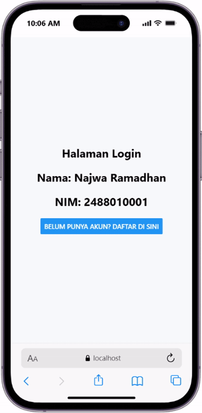
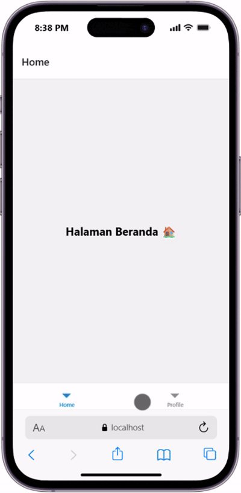
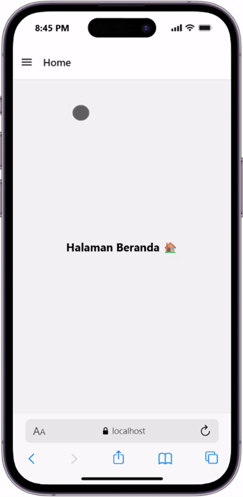

# NAVIGATION in REACT NATIVE #

### Tujuan Pembelajaran ###
Setelah mengikuti praktikum ini, mahasiswa diharapkan mampu:
1. Menggunakan navigasi antar halaman menggunakan komponen navigation pada React Native
2. Memnggunakan props untuk mengirimkan data antar halaman
3. Membuat navigasi dengan stack, tab, dan Drawer Navigation

### Langkah Praktikum ###
### Langkah 1: Persiapan Projek Navigasi ###
1. Membuat project baru bernama ptmn4 (npx create-expo app ptmn4 --template blank)
2. Change Directory ke ptmn4 (cd ptmn4)
3. Install core navigation (npm install @react-navigation/native)
4. Install dependensi pendukung (wajib untuk expo) (npx expo install react-native-screens react-native-safe-area-context react-native-gesture-handler react-native-reanimated)

### Langkah 2: Membuat Stack Navigation ###
1. Install library untuk navigation stack (npm install @react-navigation/native-stack)
2. Buat folder screens
3. Buat file Login.js dan Signup.js di folder screens
4. Sesuaikan isi file App.js dengan yang ada di modul
5. Instal untuk Web Emulator (npx expo install react-dom react-native-web)
6. npx expo start --web
7. Konfirmasi akun

### Langkah 3: Bottom Tab Navigation ###
1. Instalasi Pustaka Bottom Tabs (npm install @react-navigation/bottom-tabs)
2. Buat file HomeScreen.js dan ProfileScreen.js di dalam folder screens
3. Sesuaikan isi file App.js dengan yang ada di modul bagian Bottom Tab Navigation
4. Konfirmasi bukti

### Langkah 4: Drawer Navigation ###
1. Instalasi Pustaka Drawer (npm install @react-navigation/drawer)
2. Konfigurasi Drawer di App.js (Sesuaikan isi file App.js dengan yang ada di modul bagian Drawer Navigation)
3. Konfirmasi bukti

